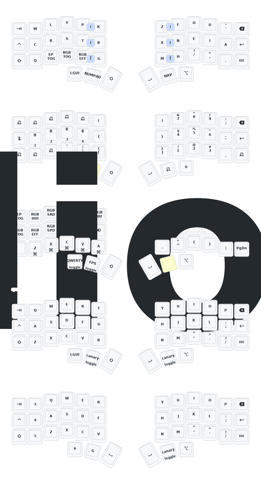

# ZMK configuation for a Corne Keyboard with Nice!Nano v1

## Canary layout is the Default Layer

Layer 0 is Canary, while moving the SPACE to the right side, having SHIFT on the left thumb
and RETURN is on the far right edge (I kept hitting return too much)

Layer 1 contains the numpad on the left, plus some symbols for programming. No need for top row numbers when I have a Numpad

Layer 2 is the control layer, with arrow keys and volume and RGB controls

Layer 3 is toggleable and is QWERTY with the same Thumb choices I made on the default

Layer 4 is my custom gaming layer for Call of Duty and other FPSes. All the keys I need on the left hand.

